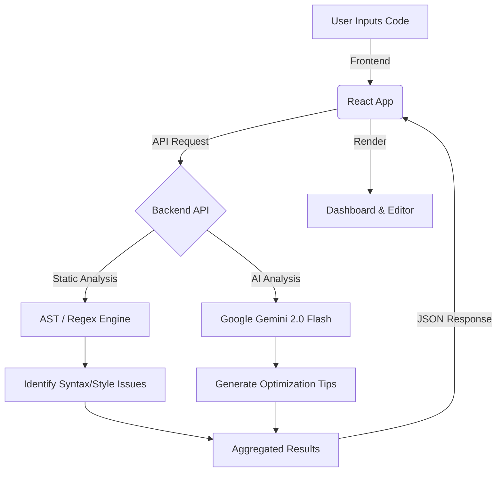

# Code Review Analytics Tool

A modern, automated code review system that leverages static analysis and AI (Google Gemini 2.0 Flash) to provide deep insights, security checks, and code optimization tips.


## 🚀 Features

-   **Multi-Language Support**: Analyze Python, JavaScript, Java, C++, and more.
-   **Static Analysis**: AST-based parsing for deep syntax and structure checks (Python) and regex-based checking for other languages.
-   **AI-Powered Insights**: Integrates with **Google Gemini 2.0 Flash** for high-level architectural feedback and security auditing.
-   **Modern UI/UX**: Built with React, Vite, Tailwind CSS, and Framer Motion for a smooth "Glassmorphism" experience.
-   **Security**: Scans for vulnerabilities like `eval()`, SQL injection risks, and exposed secrets.
-   **Metrics & Visualization**: Displays complexity scores, issue severity distribution, and more.

## 🛠️ Tech Stack

### Frontend
-   **React** (Vite)
-   **TypeScript**
-   **Tailwind CSS**
-   **Framer Motion** (Animations)
-   **Monaco Editor** (Code Input)
-   **Recharts** (Data Visualization)

### Backend
-   **FastAPI** (Python)
-   **Uvicorn** (ASGI Server)
-   **Google Gemini API** (AI Analysis)
-   **AST / Regex** (Static Analysis)

---

## 📦 Installation & Setup

## 🌐 Live Deployment
- The frontend is configured for GitHub Pages.
- After pushing to `main`, the workflow at [.github/workflows/deploy-pages.yml](file:///D:/minor%20project/.github/workflows/deploy-pages.yml) builds and deploys.
- Live URL format: `https://<your-username>.github.io/Code-review-analytics-tool/`
- Vite base path is set in [vite.config.ts](file:///D:/minor%20project/frontend/vite.config.ts) for pages.

### Prerequisites
-   Node.js (v18+)
-   Python (3.11+)

### Quick Start (Windows)
1.  Clone the repository:
    ```bash
    git clone https://github.com/Rani-commits/Code-review-analytics-tool.git
    cd Code-review-analytics-tool
    ```

2.  Run the automated setup and start script:
    ```bash
    run.bat
    ```
    This script will:
    -   Create a virtual environment for the backend.
    -   Install Python dependencies.
    -   Install Node.js dependencies for the frontend.
    -   Start both servers.

### Manual Setup

#### Backend
```bash
cd backend
python -m venv venv
venv\Scripts\activate
pip install -r requirements.txt
cp .env.example .env
# Edit .env and add your GEMINI_API_KEY
uvicorn app.main:app --reload
```

#### Frontend
```bash
cd frontend
npm install
npm run dev
```

---

## 🤖 AI Configuration

1.  Get a free API Key from [Google AI Studio](https://aistudio.google.com/app/apikey).
2.  Open `backend/.env` (create it from `.env.example`).
3.  Add your key:
    ```env
    GEMINI_API_KEY=your_api_key_here
    ```
4.  Restart the backend.

---

## 📊 Flow Chart



## 🏗️ Architecture

The system follows a modular **Client-Server** architecture.

-   **Frontend**: Handles user interaction, code editing, and result visualization. It communicates with the backend via RESTful APIs.
-   **Backend**: 
    -   **`app/api`**: API Routes definition.
    -   **`app/core/analysis.py`**: The static analysis engine.
    -   **`app/core/ai.py`**: The AI integration layer.

## 🔒 Security Note

-   **API Keys**: Never commit your `.env` file. It is included in `.gitignore`.
-   **Input Validation**: The backend sanitizes inputs before processing.

---

**Designed by Rani**
