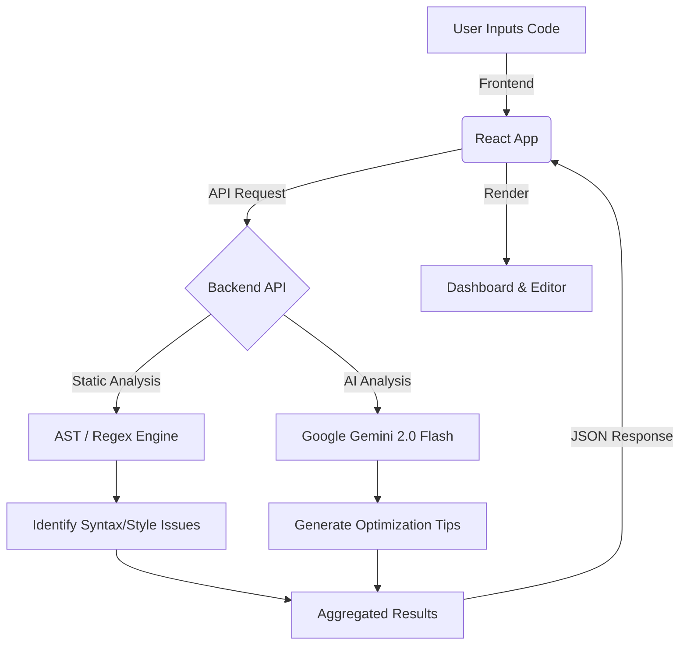
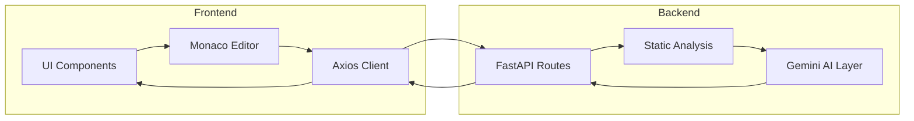

# Flowcharts

```mermaid
graph TD
    A[User Inputs Code] -->|Frontend| B(React App)
    B -->|API Request| C{Backend API}
    C -->|Static Analysis| D[AST / Regex Engine]
    C -->|AI Analysis| E[Google Gemini 2.0 Flash]
    D --> F[Identify Syntax/Style Issues]
    E --> G[Generate Optimization Tips]
    F --> H[Aggregated Results]
    G --> H
    H -->|JSON Response| B
    B -->|Render| I[Dashboard & Editor]
```

```mermaid
flowchart LR
    subgraph Frontend
        UI[UI Components]
        EDITOR[Monaco Editor]
        API[Axios Client]
    end
    subgraph Backend
        ROUTES[FastAPI Routes]
        ANALYSIS[Static Analysis]
        AI[Gemini AI Layer]
    end
    UI --> EDITOR --> API --> ROUTES --> ANALYSIS --> AI --> ROUTES
    ROUTES --> API --> UI
```

